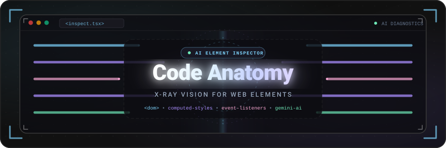
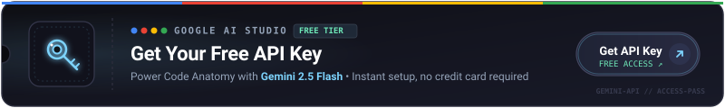

<p align="center">
  
</p>

<p align="center">
  <a href="#-features"></a>
  <a href="#-installation"></a>
  <a href="#-getting-your-ai-api-key"></a>
  <a href="#-browser-support"></a>
</p>

<p align="center">
  
  
  
  
  
</p>

<br/>

> **Code Anatomy** is a browser extension that gives you **X-ray vision** for any web page. Click any element and instantly see its **HTML structure**, **CSS rules**, **JavaScript event listeners**, and get **AI-powered explanations** — all in a sleek side panel. It's like Chrome DevTools, but designed for **learning** and **understanding**.

<br/>


<br/>

## ✦ Features

<table>
<tr>
<td width="50%">

### 🔬 HTML X-Ray
- Full **outer HTML** of any selected element
- Syntax-highlighted with tag, attribute & value coloring
- Pretty-printed with proper indentation
- **One-click copy** to clipboard

</td>
<td width="50%">

### 🎨 CSS Dissection
- **Matched CSS rules** with their selectors
- **Inline styles** extracted and displayed
- **Computed styles** in a clean grid layout
- **Pseudo-class inspector** (`:hover`, `:focus`, `:active`, etc.)
- **Force-trigger** any pseudo state on the live page

</td>
</tr>
<tr>
<td width="50%">

### ⚡ JavaScript Connections
- **Event listeners** on the element (click, input, etc.)
- **Child element listeners** — events bubbling up
- **React props** detection (onClick, onMouseEnter, etc.)
- **DOM access tracking** — which `querySelector` calls target it
- **DOM manipulations** — `setAttribute`, `classList` changes
- **Scope context** — see the full enclosing function

</td>
<td width="50%">

### 🤖 AI-Powered Explanations
- **One-click summary** of what any element does
- Powered by **Google Gemini Flash** (free API)
- Explains **purpose**, **structure**, **styling**, and **accessibility**
- Detects **Bootstrap** & **Tailwind** classes automatically
- **Follow-up chat** — ask deeper questions about the element
- Markdown-rendered responses with code highlighting

</td>
</tr>
</table>

<br/>

### 🎯 Plus...

<table>
<tr>
<td align="center" width="25%">
<br/>
<strong>Element Picker</strong><br/>
<sub>Visual overlay highlights<br/>elements as you hover</sub>
</td>
<td align="center" width="25%">
<br/>
<strong>Shadow DOM</strong><br/>
<sub>Inspects inside web<br/>components & shadow roots</sub>
</td>
<td align="center" width="25%">
<br/>
<strong>iFrame Support</strong><br/>
<sub>Drills into same-origin<br/>iframes for inspection</sub>
</td>
<td align="center" width="25%">
<br/>
<strong>Context Menu</strong><br/>
<sub>Right-click → "Inspect<br/>with Code Anatomy"</sub>
</td>
</tr>
</table>

<br/>


<br/>

## 🛠 How It Works

```
  ┌─────────────────────────────────────────────────────────────────────┐
  │                                                                     │
  │    1. ACTIVATE          2. SELECT            3. ANALYZE             │
  │                                                                     │
  │    Click the icon       Hover & click        Side panel opens       │
  │    or press Alt+C       any element          with full breakdown    │
  │                                                                     │
  │    ┌──┐                 ┌──────────┐         ┌─────────────┐       │
  │    │⚡│  ──────────►    │ ▓▓▓▓▓▓▓▓ │  ───►   │ HTML  │ CSS │       │
  │    └──┘                 │ ░░░▓▓░░░ │         │ JS    │ AI  │       │
  │                         └──────────┘         └─────────────┘       │
  │                                                                     │
  └─────────────────────────────────────────────────────────────────────┘
```

**Three ways to activate:**

| Method | Action |
|--------|--------|
| 🖱️ **Extension Icon** | Click the Code Anatomy icon in your toolbar |
| ⌨️ **Keyboard Shortcut** | Press `Alt + C` (Mac: `Ctrl + C`) |
| 📋 **Right-Click Menu** | Right-click any element → *"Inspect with Code Anatomy"* |

<br/>


<br/>

## 📦 Installation

### From Source (Development)

```bash
# 1. Clone the repository
git clone https://github.com/Mohammed-Awad-ENG/Code-Anatomy.git
cd Code-Anatomy

# 2. Install dependencies
npm install

# 3. Start development mode
npm run dev              # → Chrome (default)
npm run dev:firefox      # → Firefox
```

### Load the Extension

<details>
<summary><strong>🟢 Google Chrome</strong></summary>

1. Open `chrome://extensions` in your address bar
2. Enable **Developer mode** (toggle in the top-right corner)
3. Click **"Load unpacked"**
4. Select the `.output/chrome-mv3/` folder from this project
5. The Code Anatomy icon will appear in your toolbar

</details>

<details>
<summary><strong>🔵 Microsoft Edge</strong></summary>

1. Open `edge://extensions` in your address bar
2. Enable **Developer mode** (toggle in the left sidebar)
3. Click **"Load unpacked"**
4. Select the `.output/chrome-mv3/` folder (Edge uses the same Chrome build)
5. The Code Anatomy icon will appear in your toolbar

</details>

<details>
<summary><strong>🟠 Brave</strong></summary>

1. Open `brave://extensions` in your address bar
2. Enable **Developer mode** (toggle in the top-right corner)
3. Click **"Load unpacked"**
4. Select the `.output/chrome-mv3/` folder (Brave uses the Chrome build)
5. The Code Anatomy icon will appear in your toolbar

> **Note:** Brave Shields may interfere with the Gemini AI API calls. If AI features don't work, click the Brave Shield icon and allow connections to `generativelanguage.googleapis.com`.

</details>

<details>
<summary><strong>🔴 Vivaldi</strong></summary>

1. Open `vivaldi://extensions` in your address bar
2. Enable **Developer mode** (toggle in the top-right corner)
3. Click **"Load unpacked"**
4. Select the `.output/chrome-mv3/` folder (Vivaldi uses the Chrome build)
5. The Code Anatomy icon will appear in your toolbar

> **Note:** In Vivaldi, the side panel may appear as a **Web Panel**. You can also pin it to Vivaldi's sidebar for quick access.

</details>

<details>
<summary><strong>🔴 Opera</strong></summary>

1. Open `opera://extensions` in your address bar
2. Enable **Developer mode** (toggle in the top-right corner)
3. Click **"Load unpacked"**
4. Select the `.output/chrome-mv3/` folder (Opera uses the Chrome build)
5. The Code Anatomy icon will appear in your toolbar

> **Note:** If you're using Opera GX, the same steps apply. Opera's built-in ad blocker should not affect extension functionality.

</details>

<details>
<summary><strong>🟠 Firefox</strong></summary>

1. Open `about:debugging#/runtime/this-firefox` in your address bar
2. Click **"Load Temporary Add-on..."**
3. Navigate to `.output/firefox-mv3/` and select the `manifest.json` file
4. The Code Anatomy icon will appear in your toolbar

> **⚠️ Important:** Firefox temporary add-ons are removed when Firefox closes. For persistent installation, the extension needs to be signed via [Firefox Add-ons](https://addons.mozilla.org/).

</details>

<details>
<summary><strong>⚪ Safari</strong></summary>

Safari requires extensions to be distributed through the Mac App Store or converted using Xcode. **Direct loading of unpacked extensions is not supported.**

To use Code Anatomy on Safari:
1. Consider using the Chrome or Firefox version instead
2. If you need Safari specifically, the extension would need to be converted using Apple's `safari-web-extension-converter` tool and built with Xcode

> **⚠️ Not officially supported** — Safari's extension model differs significantly from Chromium/Firefox. We recommend using a Chromium-based browser or Firefox for the best experience.

</details>

### Build for Production

```bash
npm run build              # → Chrome production build (works for all Chromium browsers)
npm run build:firefox      # → Firefox production build

npm run zip                # → Chrome .zip for distribution
npm run zip:firefox        # → Firefox .zip for distribution
```

<br/>


<br/>

## 🔑 Getting Your AI API Key

<p align="center">
  
</p>

The AI features are powered by **Google Gemini Flash** — it's **free** and takes about 30 seconds to set up.

### Step-by-Step Guide

<table>
<tr>
<td width="60">

**1**

</td>
<td>

**Go to Google AI Studio**

Open [**aistudio.google.com**](https://aistudio.google.com/) in your browser and sign in with your Google account.

</td>
</tr>
<tr>
<td width="60">

**2**

</td>
<td>

**Get your API Key**

Click the **"Get API Key"** button in the left sidebar (or top navigation). Then click **"Create API key"** and select any Google Cloud project (or create a new one).

</td>
</tr>
<tr>
<td width="60">

**3**

</td>
<td>

**Copy the Key**

Your API key will look like this: `AIzaSy...` — copy it to your clipboard.

</td>
</tr>
<tr>
<td width="60">

**4**

</td>
<td>

**Paste into Code Anatomy**

Open the Code Anatomy side panel → click **"Settings"** (bottom of panel) → paste your API key → click **"Save"**.

</td>
</tr>
</table>

> [!TIP]
> The **Gemini Flash** model is free with generous rate limits. Your API key is stored **locally** in your browser — it never leaves your machine except to make direct API calls to Google.

> [!IMPORTANT]
> You need an API key **only for the AI features**. The HTML, CSS, and JavaScript inspection panels work perfectly without one.

<br/>


<br/>

## 🌐 Browser Support

Choose the right build for your browser:

<table>
<tr>
<th align="center">Browser</th>
<th align="center">Build Command</th>
<th align="center">Output Folder</th>
<th align="center">Panel Type</th>
</tr>
<tr>
<td align="center">
  
</td>
<td>

```bash
npm run build
```

</td>
<td>

`.output/chrome-mv3/`

</td>
<td>Side Panel API</td>
</tr>
<tr>
<td align="center">
  
</td>
<td>

```bash
npm run build
```

</td>
<td>

`.output/chrome-mv3/`

</td>
<td>Side Panel API</td>
</tr>
<tr>
<td align="center">
  
</td>
<td>

```bash
npm run build
```

</td>
<td>

`.output/chrome-mv3/`

</td>
<td>Side Panel API</td>
</tr>
<tr>
<td align="center">
  
</td>
<td>

```bash
npm run build
```

</td>
<td>

`.output/chrome-mv3/`

</td>
<td>Side Panel API</td>
</tr>
<tr>
<td align="center">
  
</td>
<td>

```bash
npm run build
```

</td>
<td>

`.output/chrome-mv3/`

</td>
<td>Side Panel API</td>
</tr>
<tr>
<td align="center">
  
</td>
<td>

```bash
npm run build:firefox
```

</td>
<td>

`.output/firefox-mv3/`

</td>
<td>Sidebar Action</td>
</tr>
<tr>
<td align="center">
  
</td>
<td>

—

</td>
<td>

—

</td>
<td>Not Supported</td>
</tr>
</table>

> [!NOTE]
> All **Chromium-based browsers** (Chrome, Edge, Brave, Vivaldi, Opera, Arc) use the same Chrome build with the `sidePanel` API. **Firefox** uses its own `sidebar_action` API. The WXT framework handles these differences automatically.

> [!WARNING]
> **Safari** does not support loading unpacked Manifest V3 extensions. It requires conversion via Xcode and distribution through the Mac App Store.

<br/>


<br/>

## ⚙️ Settings

Access settings from the **gear icon** at the bottom of the side panel:

| Setting | Description |
|---------|-------------|
| 🔑 **Gemini API Key** | Your Google AI Studio API key for AI-powered explanations |
| 🔘 **Floating Button** | Toggle the floating action button (FAB) on web pages — a quick shortcut to activate the element picker without using the toolbar icon |

<br/>

## 🏗️ Architecture

```
Code Anatomy
├── src/
│   ├── entrypoints/
│   │   ├── background.ts          # Service worker: context menus, shortcuts, panel control
│   │   ├── content.ts             # Element picker: overlay, click handling, CSS extraction
│   │   ├── injected.content.ts    # MAIN world: intercepts addEventListener, querySelector, etc.
│   │   └── sidepanel/
│   │       ├── index.html         # Side panel shell
│   │       ├── main.ts            # Panel orchestrator & settings
│   │       ├── style.css          # Dark theme design system
│   │       ├── components/
│   │       │   ├── html-panel.ts  # HTML viewer with syntax highlighting
│   │       │   ├── css-panel.ts   # CSS rules, computed styles, pseudo-class forcing
│   │       │   ├── events-panel.ts # Event listeners, DOM access, manipulations
│   │       │   └── ai-panel.ts    # Gemini AI summary & follow-up chat
│   │       └── utils/
│   │           ├── syntax-highlight.ts   # HTML/CSS/JS syntax coloring
│   │           └── framework-detector.ts # Bootstrap & Tailwind class detection
│   └── lib/
│       └── messaging.ts           # Type definitions for all message passing
├── assets/
│   └── icon.svg                   # Extension icon (X-ray code block design)
├── public/
│   └── icon-*.png                 # Extension icons at 16, 32, 48, 128px
├── wxt.config.ts                  # WXT build configuration & manifest
└── package.json
```

<br/>

## 🔍 What Gets Inspected

<details>
<summary><strong>HTML Panel</strong></summary>

- Full `outerHTML` (truncated at 5000 chars for very large elements)
- Pretty-printed with indentation
- Syntax highlighted (tags, attributes, values, text)
- Copy button

</details>

<details>
<summary><strong>CSS Panel</strong></summary>

**Pseudo-Classes** — Interactive controls:
- `:hover`, `:focus`, `:active`, `:focus-within`, `:focus-visible`
- `:visited`, `:checked`, `:disabled`, `:enabled`
- `:valid`, `:invalid`, `:required`, `:optional`
- **Trigger (1s)** — flash the state for 1 second
- **Force Toggle** — permanently force the state on/off

**Applied Styles** — All matching CSS rules from:
- Regular stylesheets
- `@media` queries (shown with their conditions)
- `@supports`, `@layer`, `@container` rules
- Shadow DOM adopted stylesheets

**Inline Styles** — Styles from the `style` attribute

**Computed Styles** — Final resolved values for:
- Layout: `display`, `position`, `z-index`, `flex-*`, `grid-*`
- Box Model: `width`, `height`, `margin`, `padding`
- Typography: `font-family`, `font-size`, `font-weight`, `line-height`
- Visual: `background`, `color`, `border`, `border-radius`, `box-shadow`, `opacity`
- Animation: `transform`, `transition`

</details>

<details>
<summary><strong>JavaScript Panel</strong></summary>

- **Native Event Listeners** — `addEventListener` calls with handler source code
- **Child Event Listeners** — Events on descendant elements
- **React Framework Events** — `onClick`, `onMouseEnter`, etc. from `__reactProps$`
- **DOM Access Queries** — `querySelector`, `getElementById`, `getElementsByClassName`, etc.
- **DOM Manipulations** — `setAttribute`, `classList.add/remove`, tracked from page load
- **Scope Context** — Expandable view of the enclosing function for each DOM access

</details>

<details>
<summary><strong>AI Panel</strong></summary>

- One-click analysis powered by Gemini Flash
- Covers: Purpose, Structure, Styling, Framework classes, Accessibility
- Multi-turn follow-up chat for deeper exploration
- Markdown rendering with code blocks

</details>

<br/>


<br/>

## 🧑‍💻 Development

```bash
# Install dependencies
npm install

# Start in dev mode (hot reload)
npm run dev

# Type check
npm run compile

# Build for production
npm run build
```

The project uses [**WXT**](https://wxt.dev/) — a modern framework for building browser extensions with Vite, TypeScript, and auto-imports.

<br/>

## 🧬 Tech Stack

<table>
<tr>
<td align="center" width="20%"><strong>WXT</strong><br/><sub>Extension Framework</sub></td>
<td align="center" width="20%"><strong>TypeScript</strong><br/><sub>Type Safety</sub></td>
<td align="center" width="20%"><strong>Vite</strong><br/><sub>Build Tool</sub></td>
<td align="center" width="20%"><strong>Gemini Flash</strong><br/><sub>AI Engine</sub></td>
<td align="center" width="20%"><strong>Marked</strong><br/><sub>Markdown Renderer</sub></td>
</tr>
</table>

<br/>


<br/>

<p align="center">
  <sub>Built with 🩻 by <a href="https://github.com/Mohammed-Awad-ENG">Mohammed Awad</a></sub><br/>
  <sub>Code Anatomy — See what others can't.</sub>
</p>
